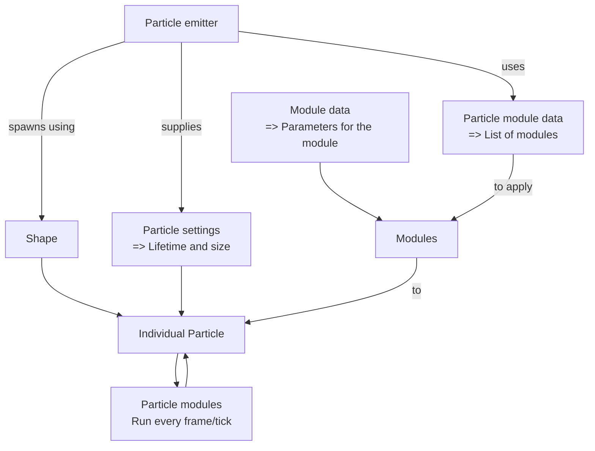

Quasar is an advanced particle system that is fully data-driven. Instead of defining individual particles, Quasar instead defines particle _emitters_ which allow for multiple particles to be emitted at once/over time. These particles have modules attached to them, which allow them to have more complex properties. There are many modules available as base building blocks, but more can be implemented using Java. Quasar allows for significantly more flexibility in comparison to vanilla particles, as well as easier hot-swapping and registration.

# Key concepts

❗ These paths go off of `assets/modid/quasar`.

### Particle Emitters

- **Folder Path: `emitters`**
- **[Particle Emitter Codec](https://github.com/FoundryMC/Veil/blob/1.21/common/src/main/java/foundry/veil/api/quasar/data/ParticleEmitterData.java#L27)**

Particle emitters are the starting point for everything related to Quasar's particles. They define a few variables about
themselves, like the emitter's lifetime and the rate at which the emitter emits particles. More importantly, they also hold the links to the
particle data that defines how particles behave and the shape that describes where particles spawn.

Syntax:
```json5
{
  // Required
  // How long the emitter emits particles, in ticks
  "max_lifetime": 20,
  // Optional
  // Whether the emitter will reset after max_lifetime ticks
  "loop": true,
  // Required
  // The delay between particles being emitted, in ticks
  "rate": 5,
  // Required
  // How many particles are emitted every [rate] ticks
  "count": 2,
  // Required
  // The settings that define how to emit the particles
  "emitter_settings": {
    // Required
    "shape": "modid:path/to/emitter/shape",
    // Required
    "particle_settings": "modid:path/to/particle/settings",
    // Optional
    // Forces all particles to be spawned
    "force_spawn": false
  },
  // Required
  // The data that define how each particle behaves
  "particle_data": "modid:path/to/particle/data"
}
```

### Particle Settings

- **Folder Path: `modules/emitter/particle`**
- **[Particle Settings Codec](https://github.com/FoundryMC/Veil/blob/1.21/common/src/main/java/foundry/veil/api/quasar/data/ParticleSettings.java#L26)**

Sets lifetime, size, speed, initial rotation and the ranges for randomizing them.

Syntax (note that all fields are required, none are optional):
```json5
{
  // Whether the speed should be randomized. The range of the speed is between 0.5x and 1.5x the value of particle_speed
  "random_speed": false,
  // Whether the size of each particle should be randomized. The range of the size is between base_particle_size and base_particle_size + particle_size_variation
  "random_size": false,
  // Whether the lifetime of each particle should be randomized. The range of the lifetime is between particle_lifetime and particle_lifetime + particle_lifetime_variation.
  "random_lifetime": false,
  // Whether the initial direction of each particle should be randomized. The range of the direction, for each axis, is between -value and value.
  "random_initial_direction": true,
  // Currently unused. Use the init_random_rotation module.
  "random_initial_rotation": false,
  // The inital direction of each particle, potentially modified by random_direction.
  "initial_direction": [
    1.0,
    1.0,
    1.0
  ],
  "particle_size_variation": 0.0075,
  "particle_lifetime": 60,
  "particle_lifetime_variation": 0.1,
  "particle_speed": 0.1,
  "base_particle_size": 0.1
}
```

### Emitter Shapes

- **Folder Path: `modules/emitter/shape`**
- **[Emitter Shape Codec](https://github.com/FoundryMC/Veil/blob/1.21/common/src/main/java/foundry/veil/api/quasar/data/EmitterShapeSettings.java#L21)**
- **[Shape Implementations](https://github.com/FoundryMC/Veil/tree/1.21/common/src/main/java/foundry/veil/api/quasar/emitters/shape)**

A shape describes where relative to the location of the Particle Emitter to spawn the individual particles.

Possible Shapes:
- `veil:point` or `POINT`
- `veil:hemisphere` or `HEMISPHERE`
- `veil:cylinder` or `CYLINDER`
- `veil:sphere` or `SPHERE`
- `veil:cube` or `CUBE`
- `veil:torus` or `TORUS`
- `veil:disc` or `DISC`
- `veil:plane` or `PLANE`

Syntax (all fields are required):
```json5
{
  "shape": "veil:cube",
  // Dimensions, in blocks
  "dimensions": [1.5, 2.0, 1.5],
  // Rotation, in degrees
  "rotation": [45, 45, 45],
  // Whether the particles should be emitted from the surface of the shape or a random point within the shape
  "from_surface": true
}
```

### Modules

- **Folder Path: `modules`**
- **Folder Path (Init Modules): `modules/init`**
- **Folder Path (Update Modules): `modules/update`**
- **Folder Path (Render Modules): `modules/render`**
- **[Module Codecs](https://github.com/FoundryMC/Veil/tree/1.21/common/src/main/java/foundry/veil/api/quasar/data/module)**

Modules are the most powerful building block of Quasar. A module is code attached to a particle, where it is executed at
a specific time, depending on which kind of module it is. They make particles dynamic by defining movement,
color changes or light emission.

The simplest module definition would look like this:
```json5
{
  // Required
  // The name of the module
  "module": "die_on_collision"
}
```

Modules are interacted with by making a json for the Module instance, telling it which `module` to use and adding the
parameters the module takes in as further fields.

We'll talk more about the individual types of modules later in this article.

### Particle Data

- **Folder Path (Render Modules): `modules/particle_data`**
- **[Particle Data Codec](https://github.com/FoundryMC/Veil/blob/1.21/common/src/main/java/foundry/veil/api/quasar/data/QuasarParticleData.java#L52)**

Defines the properties attached to each particles. Includes any modules attached to the particle, how it is rendered, and various other properties. 

Syntax:
```json5
{
  // Required - all other fields are optional
  // The render style can be either "CUBE" or "BILLBOARD".
  // "BILLBOARD" is meant for particles with textures that always face the player, whereas "CUBE" displays colored, textureless cubes.
  "render_type": "CUBE",
  // Init modules run once on a particle when it is spawned.
  "init_modules": [
    ...
  ],
  // Update modules run every tick while the particle is alive.
  "update_modules": [
    ...
  ],
  // Collision modules run once when the particle collides with something.
  "collision_modules": [
    ...
  ],
  // Force modules also run every tick while the particle is alive and apply different changes to velocity based on module.
  "forces": [
    ...
  ],
  // Render modules run every frame and can change how the particle appears.
  "render_modules": [
    ...
  ],
  // Holds all information related to the sprite
  "sprite_data": {
    // Required
    // Path towards sprite texture
    // Base path is assets/modid, you will have to write /textures/particle/ if you want to use the same folder as vanilla.
    "sprite": "modid:path/to/particle/sprite",
    // Optional
    // Amount of frames in the animation (default 1)
    "frame_count": 2,
    // Optional
    // The time that one frame lasts for, in ticks
    "frame_time": 2.0,
    // Optional
    // The width of one frame, in pixels
    "frame_width": 16,
    // Optional
    // The height of one frame, in pixels
    "frame_height": 16,
    // Optional
    // If true, makes the animation stretch to play once throughout the lifetime of the particle. Disregards frame_time.
    // If false, the particle animation will loop.
    "stretch_to_lifetime": true,
  },
  // Whether the transparency is additive or not.
  "additive": false,
  // Whether the particle should interact with collisions or not.
  "should_collide": true,
  // Whether the particle should face the direction of its velocity.
  "face_velocity": false,
  // How much the particle should stretch based on its velocity. 0 (the default) disables velocity stretching.
  "velocity_stretch_factor": 1.0
}
```

# Working with Quasar

### Codecs:

Quasar uses codecs to read its particles from resource packs. If you are not familiar with what a codec is,
read up [here](https://gist.github.com/Drullkus/1bca3f2d7f048b1fe03be97c28f87910) or, if you are more familiar with
Java, [here (Fabric)](https://docs.fabricmc.net/develop/codecs) or [here (NeoForge)](https://docs.neoforged.net/docs/datastorage/codecs).

When you don't know what fields an entry may have, search it up on [Veil's Github](https://github.com/FoundryMC/Veil) or, if it is a Minecraft codec, use [Linkie](https://linkie.shedaniel.dev/mappings?namespace=mojang_raw&version=1.21.1&search=&translateMode=none).

### Particle Editor

Not currently finished! Please return at a later point for documentation and use a text editor
of your choice for now.

### Resource Browser

The Veil text editor is disabled in the current version. Please use an external editor with hotswapping until it is re-implemented.

~~Veil has a resource browser that allows you to edit any text file from any resource pack in-game and save it. It can be
opened by pressing the (by default) F6 key and clicking on the `Resource` Tab. Files can be edited by clicking on them
with the Right mouse button, which will open a context window with the `Open in Veil Text Editor` option. This will open
a Code editor layered over Minecraft. When you have edited the file and want to apply the changes, save it using the
editor and either press `F3+t` or use the `Reload resources` button at the top of the resource browser window to reload
all resource packs.~~

# Modules

All available modules and their IDs for use in the Particle Module data can be
found [here.](https://github.com/FoundryMC/Veil/blob/1.21/common/src/main/java/foundry/veil/api/quasar/data/ParticleModuleTypeRegistry.java#L41-L71)

We'll now go over some example modules to showcase the modules' structure. You've already seen the module `die_on_collision`, which kills the particle when it collides with the world.

The first module we'll look at is `wind`, a force module. All fields are required. You can cross reference the [raw codec](https://github.com/FoundryMC/Veil/blob/1.21/common/src/main/java/foundry/veil/api/quasar/data/module/force/WindForceData.java#L32-L34) to see how the properties line up.
```json5
{
  "module": "wind",
  // This vector will be normalized.
  "wind_direction": [1.0, 0.0, 0.0],
  "wind_speed": 2.0,
  // Strength is unused.
  "strength": 1.0
}
```
This will make all particles blow towards the positive X axis, with a strength of 2.0.

The other module we'll look at is `color`, which adds a color gradient to each particle. Again, please reference the [codec](https://github.com/FoundryMC/Veil/blob/1.21/common/src/main/java/foundry/veil/api/quasar/data/module/render/ColorParticleModuleData.java#L19-L20) to see how it corresponds to the properties of the module.

This module uses Molang to determine where along the gradient the particle is. Explaining Molang is beyond the scope of this article, but there is a good reference [here](https://bedrock.dev/docs/stable/Molang). You can see a list of available queries [here](https://github.com/FoundryMC/Veil/blob/1.21/common/src/main/java/foundry/veil/api/quasar/particle/QuasarParticle.java#L72-L88).
```json5
{
  "module": "color",
  "gradient": {
    "rgb_points": [
      {
        "percent": 0.0,
        "color": [
          255, 255, 255
        ]
      },
      {
        "percent": 1.0,
        "color": [
          255, 0, 255
        ]
      }
    ],
    "alpha_points": [
      {
        "percent": 0.0,
        "alpha": 1
      },
      {
        "percent": 1.0,
        "alpha": 0
      }
    ]
  },
  "interpolant": "q.agePercent"
}
```

### Creating Custom Modules

In case we've lost you somewhere between particle module data, module data and modules, here's the terminology:

**Module data**: JSON-defined parameters for a specific module. The corresponding Java record handles applying modules
to the particle based on the data from the JSON.

**Module**: `ParticleModuleData`-implementing class that takes values from the module data to use them in logic executed on the
particle (`init`, `update`, `render`).

**Particle module data**: Defines the modules to attach to the particle.



`ParticleModuleData#addModules` is called on the data of every module applied to each particle when each particle is
spawned and can be used to add different modules based on the module data. For example, there's [`LightModuleData`](https://github.com/FoundryMC/Veil/blob/1.21/common/src/main/java/foundry/veil/api/quasar/data/module/init/LightModuleData.java#L26)
which, depending if any properties of the light vary over time, either adds a [`StaticLightModule`](https://github.com/FoundryMC/Veil/blob/1.21/common/src/main/java/foundry/veil/api/quasar/emitters/module/render/StaticLightModule.java) or a [`DynamicLightModule`](https://github.com/FoundryMC/Veil/blob/1.21/common/src/main/java/foundry/veil/api/quasar/emitters/module/render/DynamicLightModule.java) to
the particle to save calculations.

The module itself consists of a class that implements the [`ParticleModule`](https://github.com/FoundryMC/Veil/blob/1.21/common/src/main/java/foundry/veil/api/quasar/emitters/module/ParticleModule.java) interface for the particle's lifecycle. Notably, a module that only implements `ParticleModule` will not be able to recieve other lifecycle events.
Instead, implement one of [`InitParticleModule`](https://github.com/FoundryMC/Veil/blob/1.21/common/src/main/java/foundry/veil/api/quasar/emitters/module/InitParticleModule.java), [`ForceParticleModule`](https://github.com/FoundryMC/Veil/blob/1.21/common/src/main/java/foundry/veil/api/quasar/emitters/module/ForceParticleModule.java), [`UpdateParticleModule`](https://github.com/FoundryMC/Veil/blob/1.21/common/src/main/java/foundry/veil/api/quasar/emitters/module/UpdateParticleModule.java), [`CollisionParticleModule`](https://github.com/FoundryMC/Veil/blob/1.21/common/src/main/java/foundry/veil/api/quasar/emitters/module/CollisionParticleModule.java), [`RenderParticleModule`](https://github.com/FoundryMC/Veil/blob/1.21/common/src/main/java/foundry/veil/api/quasar/emitters/module/RenderParticleModule.java) to recieve lifecycle events of the corresponding type.

Each Module Type has to be registered in the [`ParticleModuleTypeRegistry`](https://github.com/FoundryMC/Veil/blob/1.21/common/src/main/java/foundry/veil/api/quasar/data/ParticleModuleTypeRegistry.java)
so that Veil knows how to read it from the Module Data files.

# Getting started

### Setting up the resource pack

(please note that if you are making a mod, creating a separate resource pack is unnecessary; you can instead put the `quasar` folder alongside your other assets)

Let's start by creating a resource pack with a folder structure for our particle in the `resourcepacks` folder of a
Minecraft instance running Veil:

```markdown
resourcepacks
\-particles
  |-pack.mcmeta
    \-assets
      \-modid
        \-quasar
          |-emitters
          |-modules
            |-render
            |-update
            |-init
            |-particle_data
            \-emitter
              |-particle
              |-shape
```

Note that you have to replace `modid` with the ID of the mod you want to add particles for.

For your pack.mcmeta you can just put something like this where pack format 34 is for Minecraft
1.21.1. [For other versions, look here](https://minecraft.wiki/w/Pack_format#resource_pack_format_history)

```json
{
  "pack": {
    "pack_format": 34,
    "description": "resource pack for testing Quasar"
  }
}
```

### Making a particle

❗ Remember, these paths go off of `assets/modid/quasar`.

To begin, let's define the emitter. In the `emitters` folder, create a new file called `burst.json`.
```json5
// emitters/burst.json
{
  "max_lifetime": 20,
  "rate": 1,
  "count": 2,
  ...
}
```
This makes our emitter emit particle for 20 ticks, or 1 second. As per the `rate` and `count` properties, our emitter will emit 2 particles every tick. Let's now define our emitter settings and particle data.
```json5
// emitters/burst.json
{
  ...
  "emitter_settings": {
    "shape": "modid:burst_shape",
    "particle_settings": "modid:burst_settings"
  },
  "particle_data": "modid:burst_data"
}
```
These properties reference files that will define more information about our emitter and its particles. 

Let's start with the `shape`. In the `modules/emitter/shape` folder, create another file named `burst_shape.json`. This is the file the property `"shape": "modid:burst_shape"` is referencing. For this tutorial, we'll make it emit on the surface of a small sphere.
```json5
// modules/emitter/shape/burst_shape.json
{
    "shape": "veil:sphere",
    "dimensions": [
        0.5,
        0.5,
        0.5
    ],
    "rotation": [
        0.0,
        0.0,
        0.0
    ],
    "from_surface": true
}
```
Next, in the `module/emitter/particle` folder, create `burst_settings.json`. This will define more information about each particle created, such as direction and speed.
```json5
// modules/emitter/particle/burst_settings.json
{
  "random_speed": true,
  "random_size": true,
  "random_lifetime": true,
  "initial_direction": [
      1.0,
      1.0,
      1.0
  ],
  "random_initial_direction": true,
  "random_initial_rotation": false,
  "particle_size_variation": 0.15,
  "particle_lifetime": 40,
  "particle_lifetime_variation": 20,
  "particle_speed": 1.0,
  "base_particle_size": 0.1
}
```
This makes each partile go in a random direction with a speed anywhere from 0.5-1.5, with a lifetime anywhere from 40-60 ticks and a size anywhere from 0.1-0.25.

Finally, for the last file, let's define the data attached to each particle. In the `module/particle_data` folder, let's create a file called `burst_data.json`.
```json5
// modules/particle_data/burst_data.json
{
  "render_style": "CUBE",
  "should_collide": true,
  "face_velocity": true,
  ...
}
```
This makes the particle appear as a cube rather than a billboarded sprite. It will run collision modules, and will always face the direction of its velocity. Let's now define the modules.
```json5
// modules/particle_data/burst_data.json
{
  ...
  "init_modules": [
    {
      "module": "light",
      "gradient": {
        "color": "0xFFFFFFFF"
      },
      "brightness": "3 - q.agePercent * 3",
      "radius": 5
    }
  ],
  "forces": [
    {
      "module": "drag",
      "strength": 0.9
    }
  ],
  "update_modules": [
    {
      "module": "tick_size",
      "size": "0.1 - q.agePercent * 0.1"
    }
  ],
  "collision_modules": [
    {
      "module": "die_on_collision"
    }
  ],
  "render_modules": [
    {
      "module": "color",
      "gradient": {
        "rgb_points": [
          {
            "percent": 0,
            "color": "0xFF0000"
          }
          {
            "percent": 1,
            "color": "0x0000FF"
          }
        ],
        "alpha_points": [
          {
            "percent": 0,
            "alpha": 1
          }
          {
            "percent": 1,
            "alpha": 0
          }
        ]
      },
      "interpolant": "q.agePercent"
    }
  ]
}
```
Let's go through these modules one by one. For brevity, I've defined only one module for each section. For our init module, we have the `light` module. This adds a light of a given brightness and radius with a color. Both brightness and radius are Molang expressions, which allow us to change them over time. I've used a Molang expression for brightness, which makes the brightness fade from 3 to 0 over the span of the particle's lifetime. The rest is fixed: the radius will be 5, and the color will be pure white.

Next, our force module. The one we have is the `drag` module, which continually slows down the particle over time. For the `drag` module, a lower `strength` property means that the particle slows down quicker: think of it as though it is multiplying the particle's velocity by the `strength` property. Our update module changes the size of the particle based on the lifetime. In our Molang environment, `q.agePercent` resolves to a value between 0 and 1 that is representative of how long the particle is along its lifespan. Here we use this to interpolate the size from 0.1 to 0. The collision module has no properties and requires little explanation; it just immediately kills the particle on contact with the world.

Our render module changes the color over time. It uses the same Molang as from the `light` module in the `interpolant` property, which controls where along the color gradient we are. The color gradient consists of two fields, the RGB points and the alpha points. Each point in the RGB points needs a percent and a color. Note how this color string differs from the one in the `light` module: the `light` color is static, and is ARGB as a result. In the `color` module, we use RGB, not ARGB, as alpha is defined elsewhere. The same structure is the same with alpha, with the only difference being that the property is called `alpha` instead of `color`.

### Spawning particles

Now that we have our particle properly set up, we can spawn it in.

#### Java

Since Quasar uses resource packs for its particles, it is suggested to make the code for spawning particles
fault-tolerant. If this code was not wrapped in a `try`-`catch` block, it would result in a crash if an invalid particle was attempted to be spawned.

```java
public static void spawnParticle(Entity entity, resourceLocation id){
    try {
        ParticleSystemManager manager = VeilRenderSystem.renderer().getParticleManager();
        ParticleEmitter emitter = manager.createEmitter(id);
        emitter.setAttachedEntity(entity);
        manager.addParticleSystem(emitter);
    } catch (Exception ignored) {

    }
}
public static void spawnParticle(Vec3 position, resourceLocation id){
    try {
        ParticleSystemManager manager = VeilRenderSystem.renderer().getParticleManager();
        ParticleEmitter emitter = manager.createEmitter(id);
        emitter.setPosition(position);
        manager.addParticleSystem(emitter);
    } catch (Exception ignored) {

    }
}
```

#### Commands

You can also use the `/quasar` command to spawn the particle. Its syntax is `/quasar <particleemitter> <position>`.
Please note that this command only exists client-side and therefore cannot be executed by anything other than the
player directly.

[//]: # (Should I go over creating a new module as an example step-by-step? Don't think so since the people that want to make that complex particles are probably more experienced in Java)